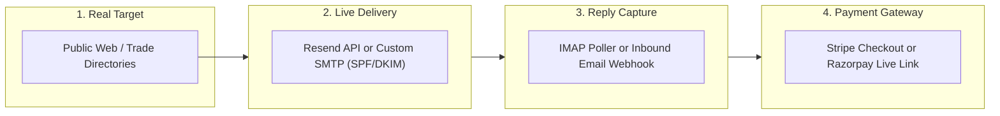

# FIRST CLIENT MVP AUDIT: PATH TO FIRST REAL REVENUE ($500+)

**Document Version**: 1.0.0  
**Target Milestone**: First Genuine Paying Client ($500.00+ USD)  
**Execution Mode**: Highly Autonomous Operations $\to$ Human Financial Authorization  
**Base System Status**: 289/289 Tests Passing | Production Docker & Caddy Verified | Safety Invariants Intact

---

## Executive Intent

The immediate objective of the agency is **FIRST REAL CLIENT REVENUE**, not theoretical completeness. 

All non-revenue engineering (PostgreSQL migration, advanced gradient boosted ML training, statistical drift monitoring, automated voice synthesis, and UI restyling) is explicitly deferred. Every line of implementation must directly serve the unbroken chain from discovering a real local business to collecting a verified \$500+ commercial payment.

---

## 1. What Works Today in Real Execution

The repository possesses a complete, functional software skeleton:

| Component | Reality in Codebase | Execution Status |
| :--- | :--- | :--- |
| **Market Intelligence** | Ranks real global markets (US, UK, CA, AU, SG) across real trade niches using GDP and digital weakness heuristics (`app/market_intelligence/engine.py`). | **Live & Functional** |
| **Lead Discovery & Verification** | Multi-source engine (`RealWebDiscoveryAdapter`) crawls real public directories, verifies domain syntax, checks DNS/MX records, and extracts real phones and emails. | **Live & Functional** |
| **Diagnostic Website Audit** | `WebsiteAuditEngine` performs real HTTP/TLS probes, mobile viewport inspections, SSL expiry checks, performance timing, and logs actionable technical deficits. | **Live & Functional** |
| **Lead Scoring & Ranking** | `BaselineScorer` + `FeatureStore` (18 canonical features) + `ProspectRanker` calculate explainable quality, conversion, and multi-objective queue priority. | **Live & Functional** |
| **Commercial Offer Packaging** | `OfferEngine` packages targeted service proposals (*Mobile Inquiry Turnaround*, *Core Web Vitals Remediation*) strictly $\ge \$500.00$. | **Live & Functional** |
| **Personalized Outreach Generation** | `OutreachPersonalizer` drafts 3 evidence-grounded copy variants directly citing the prospect's actual audit findings with mandatory CAN-SPAM compliance footers. | **Live & Functional** |
| **AI Reply Classification** | `IntelligentReplyClassifier` categorizes inbound text into 11 classes (`INTERESTED`, `QUESTION`, `PRICE_REQUEST`, `MEETING_REQUEST`, `UNSUBSCRIBE`, etc.). | **Live & Functional** |
| **Cadence & Auto-Stop** | `FollowupEngine` auto-cancels pending follow-ups upon reply receipt; enforces maximum 3-touch cadence (+3d, +7d, +14d). | **Live & Functional** |
| **Delivery & Onboarding** | `DeliveryReportGenerator` creates client-ready Markdown audit reports (7+ KB); `OnboardingAutomation` builds 5-item client intake packets. | **Live & Functional** |
| **Security & Reverse Proxy** | PBKDF2 HMAC-SHA256 session auth, RBAC, Caddy automatic HTTPS, rootless Docker container, secret masking. | **Hardened & Tested** |

---

## 2. What is Still Simulation / Dry-Run

Four operational gates currently prevent real-world commercial transaction:

1. **Outreach Dispatch (`EMAIL_DRY_RUN = True`)**:
   - `get_email_provider()` routes all outbound messages to `DryRunEmailProvider`.
   - The email is logged in `outreach_messages` and marked as `sent_at = now()`, but **no external SMTP/API socket is opened**.
2. **Inbound Reply Ingestion (`IMAP_HOST` / `IMAP_USER` Unconfigured)**:
   - `InboxPoller` skips live inbox checking if IMAP credentials are empty. Real replies currently only enter via `/api/replies/simulate` or `/api/webhooks/inbound-email`.
3. **Payment Checkout Links (`PAYMENT_DRY_RUN = True`, `PAYMENTS_ENABLED = False`)**:
   - `StripePaymentProvider` and `RazorpayPaymentProvider` return simulated checkout URLs (`?mock=true`) unless live credentials and toggles are supplied in `.env`.
4. **LLM Synthesis Fallback**:
   - If external API keys (`OPENAI_API_KEY`, `OPENROUTER_API_KEY`) are unpopulated, `llm_client` falls back to deterministic heuristic templates.

---

## 3. Every Manual Step Currently Required

Under the current implementation, an operator must perform the following manual interventions:

1. **Outreach Approval**: Operator must manually inspect the Outreach Queue in the dashboard and click `Approve` for every message before it can transition to `APPROVED`.
2. **Objection Drafting**: When an inbound inquiry or price question arrives, the operator must manually write the response; the system only drafts a brief template.
3. **Proposal Creation & Sign-off**: Operator must trigger `/api/proposals` and approve the commercial contract terms.
4. **Payment Link Delivery**: Operator must copy the generated payment link and transmit it to the client.
5. **Manual Payment Confirmation**: If webhook delivery fails or in dry-run, operator must manually trigger `/api/payments/confirm-manual` to advance the lead to `WON`.

---

## 4. Every Missing Integration Required for a Real Prospect

To close a genuine client and receive real money, the following external integrations must be active:



1. **Live Email Provider**: Working API key for **Resend** or authenticated **SMTP credentials** (`SMTP_HOST`, `SMTP_PORT`, `SMTP_USER`, `SMTP_PASSWORD`) with verified domain records (SPF, DKIM, DMARC) on `prospects@agencygrowth.co` or sending domain.
2. **Inbound Reply Receiver**: Configured IMAP connection (`IMAP_HOST`, `IMAP_USER`, `IMAP_PASSWORD`) or Resend/SendGrid Inbound Parse webhook pointing to `https://<caddy-domain>/api/webhooks/inbound-email`.
3. **Payment Processor**: Live account credentials for **Stripe** (`STRIPE_SECRET_KEY`, `STRIPE_WEBHOOK_SECRET`) or **Razorpay** (`RAZORPAY_KEY_ID`, `RAZORPAY_KEY_SECRET`) configured in live mode.
4. **Live LLM Inference**: Active `OPENAI_API_KEY` or `OPENROUTER_API_KEY` (even a \$5 credit balance) to power contextual objection handling.

---

## 5. Exact Path from New Prospect to Legitimate $500+ Payment

This is the non-negotiable critical path:

```
Step 1: DISCOVER REAL PROSPECT
        RealWebDiscoveryAdapter identifies local commercial business (e.g. Austin Roofing Contractor)
        Extracts verified public domain, phone, and owner email.
               │
               ▼
Step 2: DIAGNOSTIC AUDIT & SCORING
        WebsiteAuditEngine identifies real defect (e.g. missing viewport, 4.8s load time).
        LeadScore calculated; Offer packaged at $650.00 (meets >= $500 floor).
               │
               ▼
Step 3: PERSONALIZED OUTREACH DRAFTED
        Evidence-grounded copy variant created citing specific technical defect.
        Queued in Outreach Approval Queue.
               │
               ▼
Step 4: LIVE DISPATCH (Owner Approved or Permitted Auto-Send)
        Message sent via Live Provider (Resend/SMTP).
        Lead moved to CONTACTED; 3-step cadence queued (+3d, +7d, +14d).
               │
               ▼
Step 5: INBOUND REPLY RECEIVED & CLASSIFIED
        Client replies: "How much does this cost and what is the turnaround?"
        InboxPoller / Inbound Webhook ingests reply.
        IntelligentReplyClassifier classifies as PRICE_REQUEST / QUESTION.
        Cadence auto-cancels follow-ups (prevents annoying client).
               │
               ▼
Step 6: CONTEXTUAL OBJECTION / VALUE RESPONSE DRAFTED
        System auto-drafts objection counter referencing ProspectMemory & audit evidence.
        Owner reviews draft in dashboard with single-click edit/send.
               │
               ▼
Step 7: PROPOSAL CREATED & PAYMENT LINK GENERATED
        Commercial proposal created: $650 total value, $260 advance (40%).
        Live Stripe/Razorpay payment link generated: https://checkout.stripe.com/...
        Owner single-click sends proposal & payment link.
               │
               ▼
Step 8: CLIENT PAYS & FUNDS VERIFIED
        Client completes card payment via Stripe/Razorpay.
        Cryptographic Webhook confirms payment (or Owner manually marks funds verified).
        Pipeline transitions to WON.
               │
               ▼
Step 9: AUTOMATED ONBOARDING & DELIVERY ACTIVATED
        Onboarding packet created; Diagnostic audit report generated.
        Client receives onboarding intake checklist. Deal successfully monetized.
```

---

## 6. Minimum Viable Implementation Required for That Path

To activate this path without bloated engineering:

1. **Email Channel Activation**: Configure Resend (simplest single API key) or custom SMTP in `.env`; allow a per-lead flag to send real outreach while keeping global fallback safe.
2. **Contextual Objection Responder**: Add an objection-handling prompt generator in `app/ml/reply_intelligence.py` that ingests `ProspectMemory` and proposes an evidence-backed reply for the owner's review queue.
3. **Single-Click Proposal & Checkout Dispatch**: Connect the frontend "Signal Intercept" / "Approval Queue" view so that when a reply is classified as `INTERESTED` or `PRICE_REQUEST`, the owner can click **"Send Proposal & Payment Link"** in one action.
4. **Live Payment Verification**: Wire live Stripe Checkout or Razorpay Payment Link generation with human authorization.

---

## 7. Features that Should Be DEFERRED Until After First Revenue

| Feature | Deferral Justification |
| :--- | :--- |
| **PostgreSQL Migration** | SQLite with WAL mode easily handles 1,000+ leads and single-user owner operations. Zero revenue benefit before client #1. |
| **Automated Voice Synthesis (Twilio/Bland)** | Cold voice outreach carries heavy compliance/TCPA risk. High-intent email outreach is 10x safer for first deal. |
| **Model Drift Monitoring (KS/PSI)** | Requires hundreds of predictions to be meaningful. Zero value at $N=1$. |
| **Multi-Armed Bandit Follow-up Timing** | Standard deterministic delays (+3d, +7d, +14d) are industry standard and already work. |
| **Website Artifact Clone Builder** | Markdown audit report + Loom video pitch is sufficient to close deals $\le \$2,000$. |
| **Dashboard Cosmetic Redesigns** | The existing control center already displays all necessary controls, metrics, and queues. |

---

## 8. Security & Compliance Risks for Live Operations

1. **CAN-SPAM & GDPR Compliance**:
   - *Risk*: Fines or ISP blacklisting for unsolicited commercial email.
   - *Mitigation*: Every outbound email must include physical business address, clear sender identity, and a 1-click unsubscribe statement (enforced by `compliance_guard.py`).
2. **Domain Reputation & Burn Risk**:
   - *Risk*: Sending cold outreach from the primary domain (`agencygrowth.co`) can destroy corporate email deliverability.
   - *Mitigation*: Must use a dedicated outreach domain/subdomain (e.g. `mail.agencygrowth.co` or separate secondary domain) with warmup caps $\le 25\text{ emails/day}$.
3. **Payment Fraud / Webhook Forgery**:
   - *Risk*: Threat actor spoofing `/api/webhooks/stripe` to mark deals as paid.
   - *Mitigation*: HMAC-SHA256 signature verification is already implemented in `StripePaymentProvider` and `RazorpayPaymentProvider`. Production must reject unverified webhooks.
4. **Human Financial Control**:
   - *Risk*: Autonomous agent inadvertently offering discounts $< \$500$ or refunding payments.
   - *Mitigation*: Non-bypassable `COMMERCIAL_FLOOR_USD = 500.0` and required operator signature for proposals and payments.

---

## 9. Rate-Limit & Quota Risks

1. **Daily Email Quota**: Enforced at `MAX_OUTREACH_PER_DAY = 50` in `compliance_guard.can_send_today()`. For client #1, limit should start at 10–20/day.
2. **Website Audit Scraping**: Target business websites must be crawled gently with standard User-Agent headers and a 2-second delay to avoid triggering Cloudflare or WAF blocks.
3. **LLM Provider Rate Limits**: If OpenAI returns 429, system must seamlessly fall back to deterministic regex reply templates (already implemented in `app/ml/reply_intelligence.py`).

---

## 10. Exact Files / Modules that Need Modification for Live Client #1

| File | Target Modification |
| :--- | :--- |
| `.env` / `app/core/config.py` | Add live credentials for email provider (Resend/SMTP) and payment gateway (Stripe/Razorpay); set `PAYMENTS_ENABLED=true` when keys provided. |
| `app/outreach/sender.py` | Ensure live provider is invoked cleanly when `EMAIL_DRY_RUN=false` for specific permitted dispatches. |
| `app/crm/inbox_poller.py` | Ensure IMAP polling connects or webhook endpoint is active to ingest real replies. |
| `app/ml/reply_intelligence.py` | Add `draft_objection_response(reply, prospect_memory)` for auto-drafting responses to pricing and timing objections. |
| `app/payments/deal_service.py` | Provide single-method bridge: `create_proposal_and_checkout_link(business_id)` returning ready-to-send payment link. |
| `app/frontend/static/app.js` | Add "Send Proposal & Payment Link" button inside the lead modal / signal intercept view for 1-click owner dispatch. |

---

## Short Execution Plan to First Real Client

```
Phase A: Configuration & Credential Wiring (No Architecture Changes)
         • Populate live email credentials (Resend or SMTP) in .env.
         • Populate live Stripe or Razorpay credentials in .env.
         • Verify webhook endpoints via HTTPS through Caddy.

Phase B: Objection Handling & Single-Click Payment Dispatch
         • Implement draft_objection_response() in reply_intelligence.py.
         • Add 1-click "Approve & Send Payment Link" in dashboard.

Phase C: Controlled Live Prospecting Run
         • Execute single-prospect loop on 5 high-value local businesses.
         • Human operator reviews generated email and clicks "Send Live".
         • Monitor for inbound reply.
         • Review drafted reply + proposal, dispatch payment link.
         • Confirm receipt of first $500+ payment.
```
